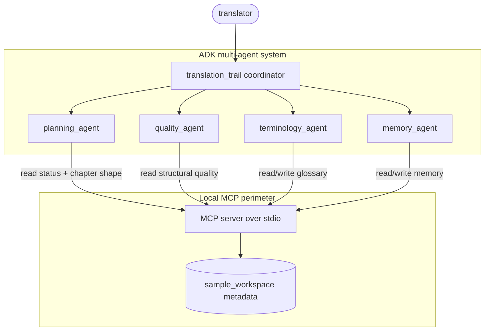

# BookWeaver Studio

**A local AI workspace for uploading an EPUB, analyzing chapters, executing translation, and exporting translated output.**

BookWeaver Studio helps a human translator manage a long EPUB translation project
without dumping the whole book into an LLM prompt. It has a visible product UI for
the actual workflow:

1. Submit a book: upload an EPUB or use the fabricated sample book.
2. Analyze the book: inspect chapters, pending work and chunking needs.
3. Execute translation: translate the next pending chapter with Gemini, or demo mode.
4. Export translated package: download translated XHTML and metadata as a ZIP.

This repository is the clean Kaggle-ready version: sample text is fabricated, secrets are
not committed, and the architecture is easy to demonstrate in ADK Web.

The ADK/MCP layer remains in the project for the capstone architecture, but the main
recording surface is the BookWeaver product page, not a clone of another project's
debug UI.

## Run The Product UI

```bash
cd bookweaver-studio
source .venv/bin/activate
uvicorn bookweaver_app:app --host 127.0.0.1 --port 7860
```

Open:

```text
http://127.0.0.1:7860
```

The page has four concrete areas:

- `Submit A Book`
- `Analyze`
- `Execute Translation`
- `Export`

If `.env` has a real `GOOGLE_API_KEY`, translation uses Gemini. If not, check
`demo mode without Gemini key` during recording to show the workflow without an
API call.

## Why This Is Also An Agent Project

Long-form translation is not one model call. A useful assistant must coordinate context,
terminology, chapter-level planning, and quality checks across many sessions. TranslationTrail
uses a coordinator plus four specialists:



## Course Concepts Demonstrated

| Course concept | Where it appears |
|---|---|
| Google ADK multi-agent system | `translationtrail/agent.py` |
| Gemini model use | ADK `LlmAgent` configured through `TRANSLATIONTRAIL_MODEL` |
| MCP server | `mcp_server/server.py` and `mcp_server/store.py` |
| Security features | Bounded tools, safe chapter IDs, no full-text MCP return, `.env.example` |
| Deployability | `docs/DEPLOYMENT.md` |
| Agent skills / tool use | Planning, glossary, memory and quality agents call MCP tools |

## Project Layout

```text
bookweaver-studio/
  translationtrail/          # Google ADK app
  mcp_server/                # Local stdio MCP server
  sample_workspace/          # Fabricated sample EPUB-like workspace
  docs/
    GOOGLE_SDK.md            # How to use ADK + Gemini SDK
    DEPLOYMENT.md            # Local and Cloud Run deployment
    KAGGLE_SUBMISSION.md     # Kaggle writeup/video/project-link checklist
    WRITEUP_DRAFT.md         # Copyable Kaggle writeup draft
    VIDEO_SCRIPT.md          # 3-5 minute demo script
  tests/                     # Deterministic MCP/store tests
```

## Quickstart

```bash
cd bookweaver-studio
python3 -m venv .venv
source .venv/bin/activate
pip install -r requirements.txt
cp .env.example .env
```

Put your Gemini key in `.env`:

```bash
GOOGLE_API_KEY=your-key
TRANSLATIONTRAIL_MODEL=gemini-3.5-flash
```

Run the deterministic tests:

```bash
python -m pytest -q
```

Start the ADK web UI:

```bash
adk web
```

Select `translationtrail`, then ask:

```text
What should I translate next?
Analyze chapter ch01 and recommend a chunking strategy.
Show glossary status.
Check quality for ch01.
Record this summary for ch01: The narrator receives a difficult letter and decides to ask for help.
```

## Safety Boundary

The MCP server intentionally does not return full chapter text. It returns chapter shape,
progress, glossary entries, bounded summaries and quality metrics. This makes the agent
useful for planning while reducing copyright and privacy risk.

## Submission Package

Use these files when preparing Kaggle:

- `docs/WRITEUP_DRAFT.md`
- `docs/VIDEO_SCRIPT.md`
- `docs/KAGGLE_SUBMISSION.md`
- public GitHub repository link
- optional Cloud Run URL after deployment
